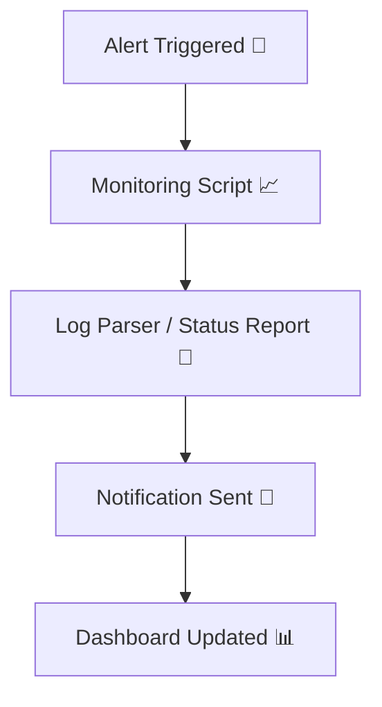
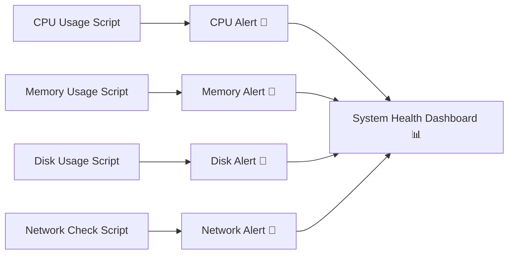

# ⚙️ Automation Scripts Repository


A collection of practical automation scripts for **incident management, monitoring, and system optimization**.  
This repository demonstrates skills in Python scripting, Linux administration, and proactive system reliability engineering.

---

## 📂 Repository Structure
```bash
automation-scripts/
│
├── dashboards/
│   └── system_health_dashboard.py
│
├── database/
│   └── check_db_connection.py
│
├── monitoring/
│   ├── disk_space_alert.py
│   ├── disk_usage.sh
│   ├── memory_usage.sh
│   ├── monitor_cpu.sh
│   ├── network_check.py
│   └── process_monitor.py
│
├── notifications/
│   └── alert_email.py
│
├── samples/
│   ├── disk_space_alert_example.log
│   ├── log_parser_summary_example.txt
│   ├── memory_alert_example.txt
│   ├── service_status_report_example.txt
│   └── system_health_dashboard_example.txt
│
├── utilities/
│   ├── .gitignore
│   ├── LICENSE
│   ├── README.md
│   └── requirements.txt

```
- **database/** → Database health checks  
- **monitoring/** → System monitoring scripts (CPU, memory, disk, processes, network)  
- **utilities/** → General automation tasks (cleanup, rotation, reporting, parsing logs)  
- **notifications/** → Alerting scripts (e.g., email notifications)  
- **dashboards/** → Consolidated system health reports  
- **samples/** → Example outputs from scripts (alerts, reports, dashboards)

---

## 🚀 Setup

1. Clone the repository:
   ```bash
   git clone https://github.com/mdolawale1-cmyk/automation-scripts.git
   cd automation-scripts

## 🛠️ Script Categories

### 🗄️ Database
- [Check Database Connection](https://github.com/mdolawale1-cmyk/automation-scripts/blob/main/database/check_db_connection.py) → Verifies database connectivity

### 📈 Monitoring
- [Monitor CPU Usage](https://github.com/mdolawale1-cmyk/automation-scripts/blob/main/monitoring/monitor_cpu.sh) → Tracks CPU usage  
- [Memory Usage Monitor](https://github.com/mdolawale1-cmyk/automation-scripts/blob/main/monitoring/memory_usage.sh) → Monitors memory usage  
- [Disk Usage Check](https://github.com/mdolawale1-cmyk/automation-scripts/blob/main/monitoring/disk_usage.sh) → Checks disk usage  
- [Disk Space Alert](https://github.com/mdolawale1-cmyk/automation-scripts/blob/main/monitoring/disk_space_alert.py) → Alerts when disk usage exceeds threshold  
- [Network Connectivity Check](https://github.com/mdolawale1-cmyk/automation-scripts/blob/main/monitoring/network_check.py) → Tests network connectivity  
- [Process Monitor](https://github.com/mdolawale1-cmyk/automation-scripts/blob/main/monitoring/process_monitor.py) → Ensures critical processes are running

### 🧰 Utilities
- [Cleanup Temporary Files](https://github.com/mdolawale1-cmyk/automation-scripts/blob/main/utilities/cleanup_temp_files.py) → Removes temporary files  
- [Service Restart Utility](https://github.com/mdolawale1-cmyk/automation-scripts/blob/main/utilities/service_restart.py) → Restarts services automatically  
- [Error Report Generator](https://github.com/mdolawale1-cmyk/automation-scripts/blob/main/utilities/error_report.py) → Generates error reports  
- [Backup Cleanup Tool](https://github.com/mdolawale1-cmyk/automation-scripts/blob/main/utilities/backup_cleanup.py) → Cleans old backups  
- [Log Rotation Script](https://github.com/mdolawale1-cmyk/automation-scripts/blob/main/utilities/log_rotation.sh) → Rotates logs  
- [Service Status Report](https://github.com/mdolawale1-cmyk/automation-scripts/blob/main/utilities/service_status_report.py) → Summarizes service status  
- [Log Parser](https://github.com/mdolawale1-cmyk/automation-scripts/blob/main/utilities/log_parser.py) → Counts errors/warnings in logs

### 📧 Notifications
- [Alert Email Sender](https://github.com/mdolawale1-cmyk/automation-scripts/blob/main/notifications/alert_email.py) → Sends email alerts

### 📊 Dashboards
- [System Health Dashboard](https://github.com/mdolawale1-cmyk/automation-scripts/blob/main/dashboards/system_health_dashboard.py) → Generates consolidated Markdown/HTML system health report

---
---
## 📊 Samples

Example outputs are available in the `samples/` folder:

- [Memory Alert Example](https://github.com/mdolawale1-cmyk/automation-scripts/blob/main/samples/memory_alert_example.txt) → Alert when memory exceeds threshold  
- [Service Status Report Example](https://github.com/mdolawale1-cmyk/automation-scripts/blob/main/samples/service_status_report_example.txt) → Daily service health summary  
- [Log Parser Summary Example](https://github.com/mdolawale1-cmyk/automation-scripts/blob/main/samples/log_parser_summary_example.txt) → Error/warning counts from logs  
- [Disk Space Alert Example](https://github.com/mdolawale1-cmyk/automation-scripts/blob/main/samples/disk_space_alert_example.log) → Disk usage alert  
- [System Health Dashboard Example](https://github.com/mdolawale1-cmyk/automation-scripts/blob/main/samples/system_health_dashboard_example.md) → Consolidated system health dashboard

---
## 🔧 Workflow Visualization

### 📊 Text‑Based Diagram (ASCII Style)

```text
+------------------+
|  Alert Triggered |
+------------------+
         ↓
+----------------------+
|  Monitoring Script   |
+----------------------+
         ↓
+--------------------------------+
|  Log Parser / Status Report    |
+--------------------------------+
         ↓
+-------------------------------+
| Notification Sent (Email/Slack) |
+-------------------------------+
         ↓
+----------------------+
|  Dashboard Updated   |
+----------------------+
```
## 🪄 Mermaid Diagram

### 📈 Monitoring Flow (Mermaid)



## Install dependencies:
```bash
pip install -r requirements.txt
```
---
---
## 📜 License
This project is licensed under the MIT License — see the [LICENSE](https://github.com/mdolawale1-cmyk/automation-scripts/blob/main/LICENSE) file for details.

## 👤 Author
**Michael Dare Olawale**

[](https://www.linkedin.com/in/michael-d-olawale-277727349/)  
[](https://github.com/mdolawale1-cmyk)

## 📖 Usage Examples

Run monitoring scripts:
```bash
python monitoring/disk_space_alert.py
bash monitoring/monitor_cpu.sh

## Generate reports:
```bash
python utilities/service_status_report.py
python dashboards/system_health_dashboard.py

##Send notifications:
```bash
python notifications/alert_email.py
```
## 🔮 Future Improvements
- Planned enhancements:
- Integration with Slack/MS Teams for real‑time alerts
- Cloud monitoring support (AWS, Azure, Kubernetes)
- Automated remediation scripts for common incidents
- Web dashboard with live system metrics
- CI/CD pipeline integration for script deployment

